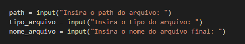
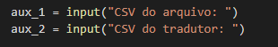
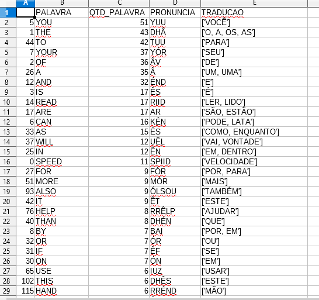

# PTradutor
O objetivo deste projeto é identificar de um texto (até o momento fazendo a leitura de um pdf) qual a quantidade de vezes que uma determinada palavra aparece no texto, e ordenar por essa quantidade, mostrando no final uma lista contendo a palavra estrangeira, a sua frequencia no texto (criterio de ordenação), e uma lista com as possiveis traduções para aquela palavra.

## Utilização

Primeiro é necessario executar o código *leitor.py*, passando os parametros abaixo. 

O código *leitor.py* salva um arquivo *.csv*, com duas colunas 

Depois é necessario passar o nome desse arquivo salvo e o nome do *Dicionario.csv* para o código *tradutor.py*  

Salvando então um arquivo com um *nome_arquivo*+_traduzindo.csv

